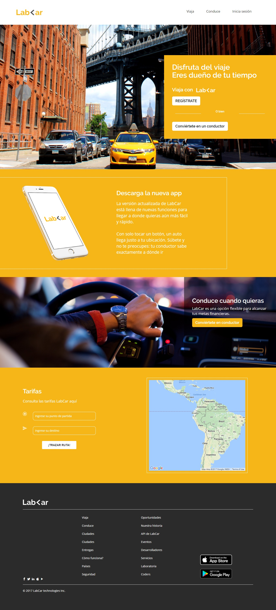

# Reto LabCar

Este proyecto consiste en replicar el modelo que se pide en las siguientes imágenes:

Para eso hemos creado este repositorio compuesto de la siguiente manera:
* **assets:** _Carpeta en la que se encontraran las siguientes subcarpetas_
  * **iconos:** _Carpeta en la que se encuentran los iconos usados en este proyecto_
  * **images:** _Carpeta en la que se encuentra todas las imagenes usadas en este proyecto_
* **css:** _Carpeta donde se encuentra nuestra hoja de estilos llamada main.css_
* **js:** _Carpeta donde se encuentra la programacion que utilizaremos llamado app.js_  
* **index.html**
* **README.md**
